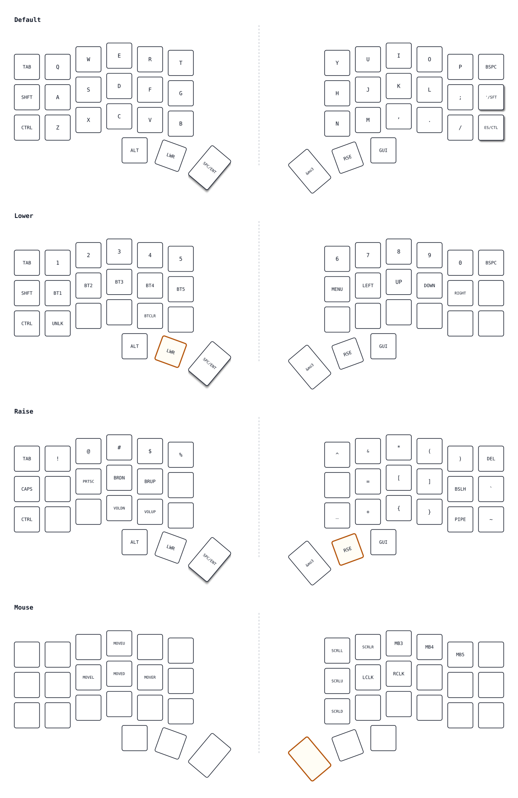

# Corne + ZMK — firmware lokal

Keymap & build script untuk Corne Cherry V3 (nice!nano v2 / nRF52840) dengan
firmware ZMK, dibangun penuh di lokal (Arch Linux, tanpa Docker).

## Isi repo ini

| File | Isi |
|---|---|
| `config/corne.conf` | opsi build: mouse pointing, deep sleep, OLED |
| `config/corne_left.keymap` | keymap (layer 0-3), dipakai kedua half |
| `config/corne_right.keymap` | symlink ke `corne_left.keymap` |
| `build.sh` | build firmware (`./build.sh left\|right\|all`) |
| `flash.sh` | build + flash interaktif via UF2 |
| `check-keymap.py` | cek diagram comment vs `bindings` di keymap, dan label vs `map.svg` |
| `map.svg` | peta tombol 4 layer (dihasilkan dari keymap, siap dicetak) |
| `.gitignore` | menutupi west workspace, venv, hasil build |

Source ZMK/Zephyr dan SDK **tidak** ikut di-commit (ratusan MB). Ikuti langkah
setup di bawah di mesin baru.

## Setup (Arch Linux)

### 1. Prasyarat

```bash
sudo pacman -S --needed git python

# serial USB untuk ZMK Studio (Arch: grup uucp)
sudo usermod -aG uucp "$USER"

# bootloader UF2 nice!nano v2 (0483:df11) bisa ditulis tanpa sudo
echo 'SUBSYSTEM=="usb", ATTR{idVendor}=="0483", ATTR{idProduct}=="df11", MODE="0666", TAG+="uaccess"' \
  | sudo tee /etc/udev/rules.d/99-uf2-flash.rules
sudo udevadm control --reload-rules && sudo udevadm trigger
```

Keluar dari login lalu login lagi supaya grup `uucp` aktif.

### 2. Python env + west

```bash
python -m venv .venv
.venv/bin/pip install --upgrade pip
.venv/bin/pip install west pyelftools pyyaml pykwalify packaging canopen natsort intelhex anytree
```

`cmake<4` di-install lewat venv karena `FindZephyr-sdk.cmake` milik Zephyr
rusak dengan CMake 4; `wget` juga di-shim ke `curl` karena skrip setup SDK
memakai `wget`. Dua-duanya otomatis dipakai karena script memanggil `west`
melalui `.venv/bin`.

### 3. Workspace west

```bash
git clone https://github.com/zmkfirmware/zmk --branch main app
cd app/app
../../.venv/bin/west init -l .
cd ../..
.venv/bin/west update          # ~3.5 GB, butuh waktu
.venv/bin/west zephyr-export
.venv/bin/west packages pip --install
```

### 4. Zephyr SDK

```bash
cd app/app
ZEPHYR_BASE="$PWD/zephyr" PATH="$PWD/../../.venv/bin:$PATH" \
  ../../.venv/bin/west sdk install --install-dir "$PWD/../../sdk" --toolchains arm-zephyr-eabi
cd ../..
```

SDK ditaruh di `./sdk` (bukan `~/`), dibaca `build.sh` lewat
`ZEPHYR_SDK_INSTALL_DIR`. Kalau foldernya dipindah, set env itu sendiri.

Binary host-tools SDK (mis. `dtc`) punya path absolut yang di-*patch* saat
install, jadi SDK **tidak boleh** dipindah dengan `mv` setelah terinstall.
Kalau perlu pindah, install ulang ke lokasi tujuan.

Butuh `wget` untuk skrip setup SDK — di sini digantikan shim `curl` di
`.venv/bin/wget` (lihat langkah 2).

## Pakai

```bash
./build.sh all        # build kedua half -> app/app/build/{left,right}/zephyr/zmk.uf2
./build.sh left

./flash.sh            # build + flash kiri lalu kanan (interaktif)
./flash.sh --no-build # pakai build terakhir
```

`flash.sh` mengenali tiap half lewat USB serial, jadi tidak akan tertukar:

| Half | Serial |
|---|---|
| kiri (central) | `7F5CD247CF72BAF0` |
| kanan (peripheral) | `7336F183FB24A382` |

Ganti serial di baris atas `flash.sh` kalau board-nya berbeda.

Masuk bootloader: **double-tap tombol reset**, atau **tahan reset sambil
colok USB**.

## Opsi build (`config/corne.conf`)

| Opsi | Efek |
|---|---|
| `CONFIG_ZMK_POINTING` | mengaktifkan `&mkp`, `&mmv`, `&msc` (mouse emulation) |
| `CONFIG_ZMK_SLEEP` | deep sleep setelah 15 menit idle (hemat baterai; hanya half central yang tidur) |
| `CONFIG_ZMK_DISPLAY` | OLED SSD1306 128×32 di I2C `0x3c`, menampilkan nomor layer |

Studio: `flash.sh`/`build.sh` menambah snippet `studio-rpc-usb-uart` +
`CONFIG_ZMK_STUDIO=y` **hanya untuk half kiri** (central). Half kanan tetap
mouse + sleep saja.

## Layer

| Layer | Isi |
|---|---|
| 0 | QWERTY, `'` tap/hold SHFT, `ESC` tap/hold CTRL, thumb `ALT LWR SPC/ENT MO RSE GUI` |
| 1 | angka, `BT1-5`, panah, `BT CLR`, `STUDIO UNLOCK` |
| 2 | simbol, `DEL`, `PRTSC`, brightness, volume |
| 3 | mouse: `E` atas, `S` kiri, `D` bawah, `F` kanan, `J` klik kiri, `K` klik kanan, scroll, `MB3-5` |

Akses layer 3: tekan-tahan `MO` di thumb (menyisakan layer 2 di thumb sebelahnya).

## Peta tombol




| Penanda | Arti |
|---|---|
| shadow | tombol hold-tap — perlu ditahan (`&mt`), contoh `'/SFT`, `ES/CTL`, `SPC/ENT` |
| outline kuning | tombol yang mengaktifkan layer aktif (Lower→`LWR`, Raise→`RSE`, Mouse→`&mo3`) |

Peta ini dibuat dari `config/corne_left.keymap`, jadi selalu ikut dengan isi
keymap. Setelah edit keymap, cek keduanya sekaligus:

```bash
python3 check-keymap.py   # bandingkan comment vs bindings, lalu bindings vs map.svg
```

Label baru yang tidak ada di `MAP` (`check-keymap.py`) akan dianggap `&trans` dan
memicu mismatch — tambah entri `MAP`-nya lebih dulu.

## Catatan penting

- **ZMK Studio menyimpan keymap di NVS device, bukan di firmware.** Setelah
  Studio dipakai, perubahan di `config/*.keymap` tidak terlihat sampai
  **Restore Stock Settings** di Studio. Flash UF2 tidak menghapus settings.
- Keymap diproses di half **kiri/central**; firmware half kanan tidak perlu
  contain keymap yang sama, tapi tetap dibangun agar sinkron.
- `build.sh` selalu pakai `-p` (pristine) supaya perubahan snippet/konfigurasi
  tidak tertinggal di CMake cache.